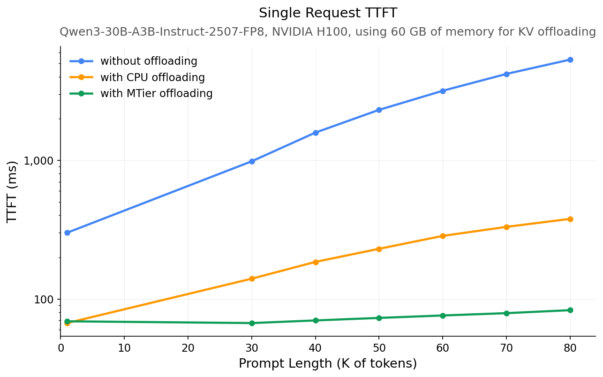

<p align="center">
  <picture>
    
  </picture>
  
</p>

<h3 align="center">
SGLang meets Netpreme's scale-up GPU memory expansion </h3>

🔥 We have built a prototype platform to enable developers and researchers to explore the use cases of scale-up GPU memory expansion. Please [contact](https://netpreme.com/developer) us to get access to it.

---

## About
This repository is a fork of SGLang that integrates Netpreme's scale-up GPU memory expansion system, X-Mem, as a dedicated tier for KV cache storage. By replacing traditional CPU DRAM with X-Mem in the hierarchical KV cache (HiCache), we leverage ~10x higher bandwidth to reduce Time to First Token (TTFT) and achieve higher throughput for KV-intensive workloads, such as multi-turn coding agents.

## Getting Started

```bash
uv venv --python 3.12
source .venv/bin/activate
git clone <url-to-repo>
cd sglang_xmem

# Install sglang
cd python
uv pip install -e .

# Install sgl-kernel (requires CUDA toolkit)
cd ../sgl-kernel
apt-get install -y libnuma-dev
export PATH=/usr/local/cuda/bin:$PATH
MAX_JOBS=10 CMAKE_ARGS="-DCMAKE_POLICY_VERSION_MINIMUM=3.5" uv pip install -e . --no-build-isolation

# Install X-Mem
uv pip install xmem-mtier==0.1.2
```

> [!NOTE]
> SGLang+X-Mem will only work on Netpreme's X-Mem VMs. Please [contact](https://netpreme.com/developer) us to get access to it.

## Usage

To replace CPU DRAM with X-Mem, add `--hicache-use-xmem` to the launch command:

```bash
python -m sglang.launch_server \
    --model Qwen/Qwen3-30B-A3B-Instruct-2507-FP8 \
    --enable-hierarchical-cache \
    --hicache-size 60 \
    --hicache-write-policy write_through \
    --hicache-io-backend kernel \
    --hicache-mem-layout layer_first \
    --page-size 64 \
    --mem-fraction-static 0.5 \
    --hicache-use-xmem
```

Or via Python API:

```python
import sglang as sgl

llm = sgl.Engine(
    model_path="Qwen/Qwen3-30B-A3B-Instruct-2507-FP8",
    page_size=64,
    mem_fraction_static=0.5,
    enable_hierarchical_cache=True,
    hicache_size=60,
    hicache_write_policy="write_through",
    hicache_io_backend="kernel",
    hicache_mem_layout="layer_first",
    hicache_use_xmem=True,
)
```

Use `--no-hicache-use-xmem` to fall back to CPU DRAM.

---

## 📊 Performance Benchmarks

We evaluated the integration of X-Mem into SGLang's hierarchical KV cache, comparing it against a CPU DRAM baseline. We used a benchmark methodology based on the vLLM blog post on KV offloading ([blog](https://vllm.ai/blog/kv-offloading-connector), [code](https://github.com/orozery/playground/blob/kv-offloading-blog-dec-2025/kvcache/kv_offload_benchmark.py)).

### Setup
  * Hardware: Single H100 GPU with 60GB of dedicated KV offloading memory (either Host DRAM or X-Mem).
  * Model: Qwen3-30B-A3B-Instruct-2507-FP8 (96 KB per-token KV cache).
  * Configuration: page_size=64 tokens, layer_first layout, write_through policy.

### Key Results

X-Mem shows significant gains over CPU DRAM for high cache-hit rate workloads, where data copying dominates computation:

* 🚀 Time to First Token (TTFT): ~4.6× faster than CPU DRAM at 80K tokens.


### Running the benchmark

```bash
# TTFT benchmark
python kvcache_benchmark.py --ttft --backend both

# X-Mem only
python kvcache_benchmark.py --ttft --backend xmem
```
